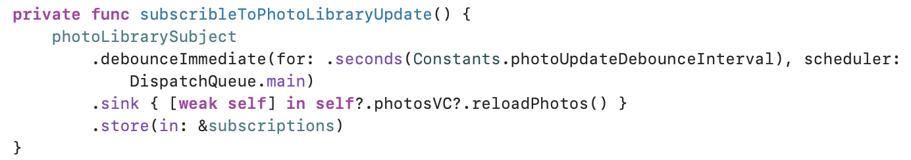
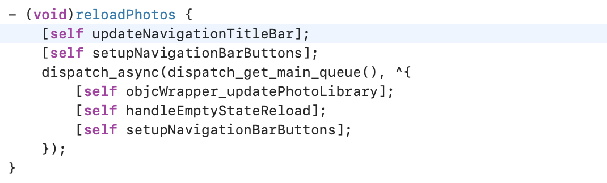
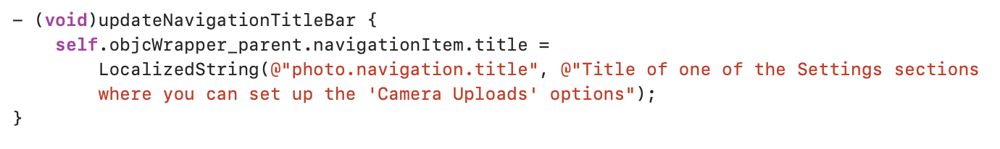
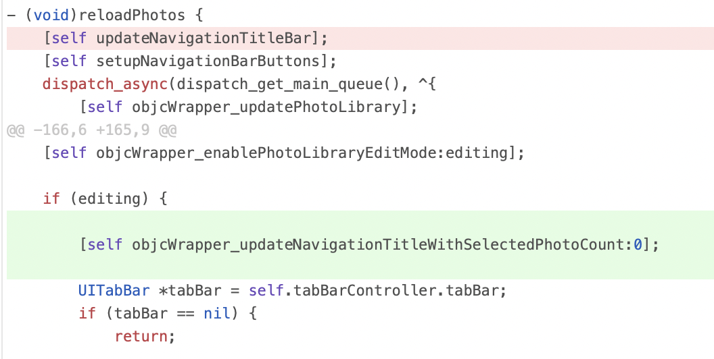

# SOLUTIONS

## Solution For Question1

## Solution For Question2

## Solution For Question3

### Root Cause

When Select Mode Enable, it call `reloadPhotos` function, but `reloadPhotos` updates navigation title without judging mode

### Solution

change navigation when mode change

 

