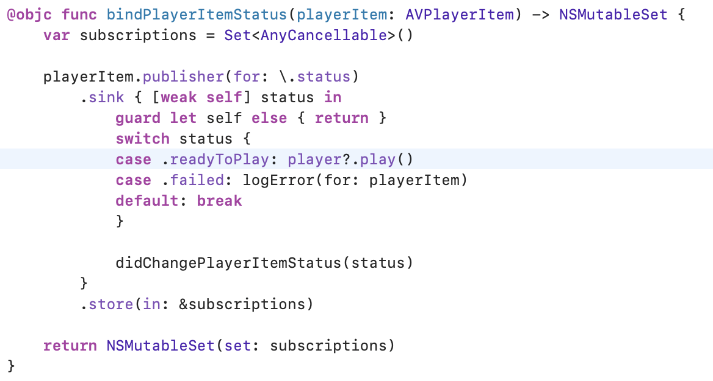
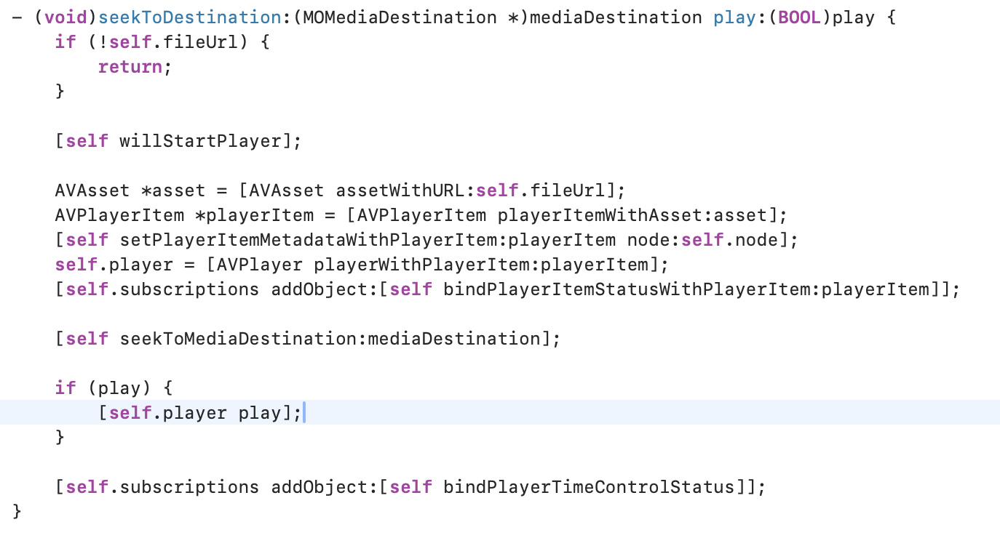

# SOLUTIONS

## Solution For Question1

## Solution For Question2

### Root Cause

When we call the `seekToDestination` function, we may trigger AVPlayer.play multiple times,which may cause the main thread hanged.

 

### Solution

Remove the extra call in the notification 

## Solution For Question3

### Root Cause

When Select Mode Enable, it call `reloadPhotos` function, but `reloadPhotos` updates navigation title without judging mode

### Solution

change navigation when mode change

 

